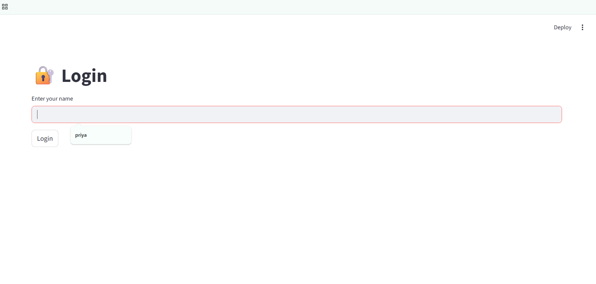
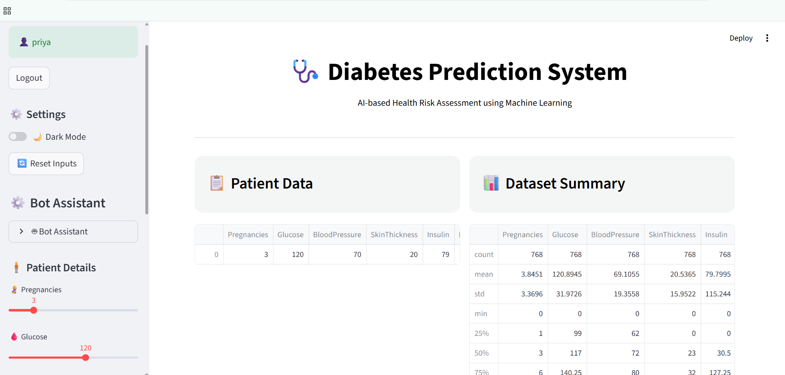
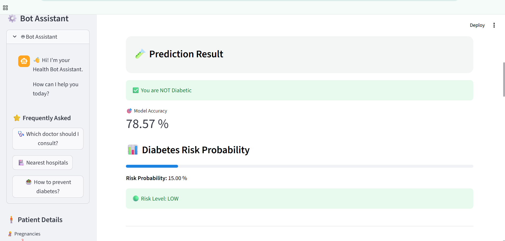
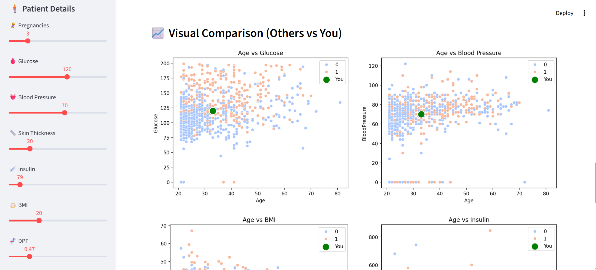
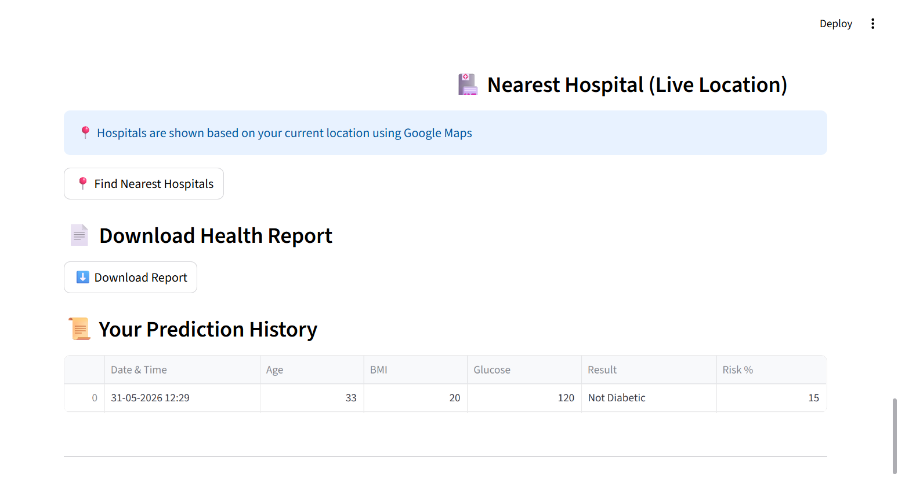

# diabetes_prediction
Preview of the Project

# DIABETES_PREDICTION
Predicting the diabets

#  Diabetes Prediction System

A Machine Learning-based web application that predicts the likelihood of diabetes using patient health parameters. The application is built with Streamlit and uses a Random Forest Classifier for prediction.

##  Features

-  User Login System
-  Diabetes Risk Prediction
-  Risk Probability Analysis
-  Dataset Visualization
-  Feature Importance Analysis
-  Personalized Health Tips
-  Prediction History Tracking
-  Hospital Recommendations
-  Google Maps Hospital Links
-  Downloadable Health Report
-  Dark Mode Support
-  Progressive Web App (PWA) Support

---

##  Technologies Used

- Python
- Streamlit
- Pandas
- NumPy
- Matplotlib
- Seaborn
- Scikit-Learn
- Random Forest Classifier

## Project Structure

Diabetes-Prediction-System/
│
├── app.py
├── diabetes.csv
├── requirements.txt
├── manifest.json
├── service-worker.js
├── screenshots/
│   ├── login.png
│   ├── dashboard.png
│   ├── prediction.png
│   └── hospitals.png
└── README.md

## Dataset

This project uses the Pima Indians Diabetes Dataset.

### Input Features

| Feature | Description |
|----------|-------------|
| Pregnancies | Number of pregnancies |
| Glucose | Blood glucose level |
| BloodPressure | Blood pressure value |
| SkinThickness | Skin fold thickness |
| Insulin | Insulin level |
| BMI | Body Mass Index |
| DiabetesPedigreeFunction | Genetic diabetes influence |
| Age | Age of patient |

### Target Variable

| Value | Meaning |
|---------|---------|
| 0 | Non-Diabetic |
| 1 | Diabetic |

## Machine Learning Model

### Algorithm Used

- Random Forest Classifier

### Workflow

1. Load Dataset
2. Data Preprocessing
3. Train-Test Split
4. Model Training
5. Prediction Generation
6. Risk Probability Calculation
7. Health Recommendation Generation

##  Installation

### Clone Repository

bash
git clone https://github.com/yourusername/Diabetes-Prediction-System.git

### Navigate to Project Folder

bash
cd Diabetes-Prediction-System

### Install Dependencies

bash
pip install -r requirements.txt

### Run Application

bash
streamlit run app.py

## Required Packages

streamlit
pandas
numpy
matplotlib
seaborn
scikit-learn

## Application Features

### Diabetes Prediction
Predicts whether a patient is diabetic or non-diabetic based on medical parameters.

### Risk Analysis
Displays:
- Risk Percentage
- Low Risk
- Medium Risk
- High Risk

### Health Suggestions
Provides:
- Diet Recommendations
- Exercise Tips
- Lifestyle Suggestions

### Prediction History
Stores:
- Date & Time
- Patient Details
- Prediction Results
- Risk Percentage

### Hospital Recommendations
Suggests nearby hospitals and provides Google Maps links for easy navigation.

### Download Report
Generates a downloadable health report containing:
- Patient Details
- Prediction Result
- Risk Probability
- Model Accuracy

## Screenshots

### Login Page
Add screenshot here:

screenshots/login.png

### Dashboard
Add screenshot here:

screenshots/dashboard.png

### Prediction Result
Add screenshot here:

screenshots/prediction.png

### Hospital Recommendations
Add screenshot here:

screenshots/hospitals.png

## Future Enhancements

- MySQL Database Integration
- User Registration & Authentication
- PDF Report Generation
- Email Notification System
- Doctor Appointment Booking
- GPS-Based Hospital Locator
- Cloud Deployment

**Diabetes Prediction System Using Machine Learning**

---

## 📄 License

This project is developed for educational and academic purposes.

## Output Screenshots

